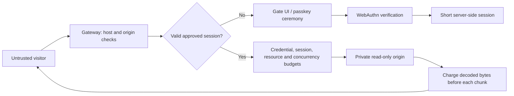

# Threat model

Human Gate has two modes with different objectives. Public mode is described first. The rest of this document, from [private mode](#private-mode-objective-and-boundary) on, covers private mode and the protections both modes share.

## Public mode: objective and boundary

Let people read the site, keep AI agents and automated browsers out, and make bulk extraction cost far more than reading. Concretely: refuse self-declared and signed AI agents, put a press-and-hold human check in front of every new visitor, bound the URLs, bytes and request rate any one network can take per window, make every additional identity cost increasing CPU work, and block networks that ignore limits for a time that grows with repeat offences. The human check gathers evidence of automation; it cannot prove that a visitor is human.

Identity is the visitor's network: the IPv4 address, or the IPv6 /64. It comes from the socket peer, or from `X-Forwarded-For` when the peer is in `TRUSTED_PROXIES`. The header is walked from the right, and parsing stops at the first untrusted hop. Networks are stored as HMACs keyed by a per-database secret. A solved proof-of-work check issues a clearance: a random token, stored hashed, with its own budget, valid for `CLEARANCE_SECONDS`.

| Attack | Handling / limitation |
| --- | --- |
| Crawl every URL from one address | Distinct-URL and byte budgets per network, then a check, then strikes and a timed block |
| Clear cookies, change user agent, use private windows | Budgets are keyed by network, so none of these reset them |
| Rotate IPv6 addresses within a subscriber allocation | Addresses in one /64 share a budget. Larger allocations (/56, /48) can still rotate /64s |
| Spoof `X-Forwarded-For` | Ignored unless the direct peer is a trusted proxy. Left-of-untrusted entries are never used |
| Mint many clearances | Capped per network per window; each costs one more bit of work (double the hashing) |
| Solve one check, share the clearance cookie across a botnet | All holders share that clearance's single budget |
| Replay or forge a solution | Challenges are single-use, bound to the issuing network, and verified server-side |
| Solve checks on a GPU or with native code | Feasible. The work cost is a speed bump that scales per identity, not a wall |
| Keep requesting while over budget | Each denial is a strike. Past `STRIKES_PER_WINDOW` the network is blocked for `BAN_SECONDS`, 4× longer on each repeat within `MAX_BAN_SECONDS`, capped at `MAX_BAN_SECONDS` |
| Many residential IPs (proxy pools) | Each network gets its own allowance. Total extraction grows with pool size. Not solved here |
| Slow agent staying within budget | Indistinguishable from a reader. Not solved here |
| Requests that bypass the gateway | Out of scope: the origin must be reachable only from the gateway |
| Cache in front of the gateway serving responses | Proxied responses are forced `private`, so shared caches should not store them. A misconfigured CDN can still bypass accounting |
| Embedding or hotlinking from other sites | Cross-site requests are rejected except top-level navigations, so links from other sites still work |

### AI agents and the human check

With `HUMAN_CHECK=suspicious` (the default), a request without a valid pass is let through unless there is a reason to ask, logged as `suspect:<reason>`:

| Reason | Trigger |
| --- | --- |
| `flagged` | The network failed the check (`automation_detected`, `sandbox_detected`, `human_check_failed`), was blocked, or paged too fast in the last hour |
| `datacenter` | The address is in the cloud ranges file |
| `automation_user_agent` | `HeadlessChrome`, `Playwright`, `Puppeteer` or `Selenium` in the user agent |
| `not_a_browser` | The user agent does not start like a browser's (curl, Python, Go, feed readers) |
| `missing_fetch_metadata` | Chrome or Firefox 90+ without `Sec-Fetch-Mode`, which both always send |
| `missing_client_hints` | Chromium 90+ without `Sec-CH-UA` in a secure context (Android WebView and Chrome on iOS are exempt) |
| `missing_language` | A page load without `Accept-Language`, or with `*` (Node's `fetch` default) |
| `paging` | More than `HUMAN_PAGES_PER_MINUTE` page loads a minute from one network without passes; flags the network for an hour |

Field test (Windows laptop): installed Edge read 20 pages a minute with no check and got it at page 21. curl, curl pretending to be Chrome, and headless Playwright got it on the first request. Playwright in a real window read directly, like Edge, until page 21. Live test on a real site over HTTPS (2026-10-05): in `suspicious` mode the owner's laptop browser loaded every page, script, font and video range with no check, while within minutes two datacenter clients and two scripts claiming to be Chrome got it. Switched to `always`, the owner passed first try with a mouse (65 movements, sandbox score 0) and with a phone's touch screen (sandbox score 0). A friend's Mac (Chrome 138, trackpad) read directly in `suspicious` mode and passed in `always` mode with 65 movements and sandbox score 1 (`bare_screen`: a hidden Dock or full-screen window leaves no reserved height, a known false positive at weight 1). Header rules only catch clients that do not bother to copy a browser; a real browser driven by a script passes them by construction. The one header rule aimed at automation tools is `unbranded_chromium`: on Windows and Mac, Chrome, Edge, Brave and Opera name themselves in `Sec-CH-UA`, while Playwright's and Puppeteer's bundled Chromium send only `"Chromium"` and a placeholder brand. A few rebuilt browsers do the same, so it asks rather than blocks, and Linux and Android are exempt.

With `HUMAN_CHECK=always`, or once there is a reason, a request without a valid pass gets the check page (HTML) or `403 human_check_required` (anything else). The page asks the server for a challenge, then the visitor holds the button for 1.5 seconds. The verify request reports the webdriver flag, known automation-tool globals, window frame size, plugin count, user-agent brands, whether the gesture was a trusted event, how long it was held, and the last 64 pointer steps. The server rejects:

- `automation_detected`: webdriver set, automation globals present, headless Chrome (a `HeadlessChrome` brand or user agent, or desktop Chrome with no window frame and no plugins), a mouse path in which one exact step of 2px or more occurs at least 10 times and makes up half or more of such steps, or a DevTools-protocol client attached (`devtools_protocol`, below);
- `human_check_failed`: an untrusted gesture, a hold shorter than 1.5 s by the page's clock *or* the server's, or a mouse that reached the button without moving, arrived in a final leap of more than 80px, or pressed more than 3px from where it last moved (how agent click tools behave);
- `invalid_solution`: the small proof of work that rides along is wrong.

### DevTools-protocol clients

Playwright, Puppeteer, Selenium 4 on Chrome, and most AI-agent browsers drive Chromium over the Chrome DevTools Protocol. Their mouse events are trusted and carry the same properties as a person's, so the check cannot tell them apart by input. What gives them away is that they enable the protocol's `Runtime` domain, after which V8 serialises every value the page logs and sends it to the client. At the end of the hold the page times 100 calls of `console.debug` with four `Error` objects against 100 with four numbers, seven rounds, and reports the median ratio (`devtools:<ratio>` in the log). At 3 or more the check fails with `devtools_protocol`. Only Chromium user agents are judged; Firefox and Safari log differently, and Chrome on iOS is WebKit.

Field measurements (Windows laptop, Edge 154, 125% display scaling):

| Browser | Ratio |
| --- | --- |
| A person's Edge, no automation | 1.29–1.50 (six runs) |
| The same, with six CPU-bound processes running | 1.22–1.57 |
| A person's Edge with DevTools open | 5.00–5.38 (refused; the message says to close DevTools) |
| Playwright Chromium, headless or in a window, any flags | 4.62–6.13 |
| Playwright driving installed Edge | 4.77–5.08 |
| Playwright attached over `connectOverCDP` to an Edge window opened normally | 4.47–6.04 |
| patchright (Playwright fork that avoids `Runtime.enable`) | 1.20–1.29: **not detected** |

The ratio is self-normalising, so a slow machine is not a problem; what separates the two groups is serialisation work that only exists when a client is listening. Anything client-side can be forged by a client that rewrites the page or calls the endpoints directly. Not yet measured on Android, Mac or Linux Chrome; `devtools:<ratio>` is logged for every check so operators can see their own distribution. Ideas tested and rejected because a person's browser triggered them too: the well-known `Error.stack` getter trick (fires nowhere in Chrome 154), accessor getters on logged `Error.message` and `RegExp.source` (fire in every browser), and float noise in `screenX - clientX` (present on scaled displays).

### Machine signals

The page also reports what kind of machine it runs on, and the server adds whether the address is in a cloud provider's published server ranges. Each signal is weighed, because real people share some of them:

| Signal | Weight | Real personal device | Cloud browser |
| --- | --- | --- | --- |
| `datacenter` | 2 | Home or mobile ISP (VPNs are the exception) | AWS, Google Cloud, Oracle, DigitalOcean, Linode |
| `unbranded_browser` | 3 | Windows and Mac browsers name themselves (Chrome, Edge, Brave, Opera) | Playwright's and Puppeteer's bundled Chromium name only `Chromium` |
| `software_gpu` | 2 | NVIDIA, AMD, Intel, Apple | SwiftShader, llvmpipe, Microsoft Basic Render Driver |
| `gpu_spoofed` | 3 | Native WebGL getter; pixels match the named GPU | Patched getter, or a real GPU's name over SwiftShader's exact pixels |
| `os_mismatch` | 2 | Windows has Segoe UI / Calibri / Consolas; a Mac has Helvetica Neue / Menlo / Avenir | Windows or Mac user agent without any of them |
| `virtual_gpu` | 1 | Rare | VMware, VirtualBox, Parallels, QEMU, virtio |
| `no_voices` | 1 | Windows and macOS ship local speech voices | None (Playwright's bundled Chromium also has none) |
| `no_media_devices`, `no_webgl` | 1 each | Speakers, microphones; WebGL on | Often none |
| `bare_screen` | 1 | Taskbar, dock or menu bar takes some height | Virtual display with nothing reserved |
| `utc_clock` | 1 | Local time zone | Often UTC |

With `SANDBOX_CHECK=enforce`, a score of 4 or more is refused with `sandbox_detected`, and 2–3 gets a pass that lasts an hour. The default, `log`, only records `sandbox:<score>` and the flags, so an operator can measure false positives first. Azure is deliberately not in the address list: Windows 365 and Azure Virtual Desktop put real people on Azure addresses.

Field measurements on a Windows laptop: installed Edge scored 0. Playwright's Chromium in a real window scored 2 (no voices, bare screen) and still got through with a faked curved path. With a software GPU it scored 4; with the GPU name faked the way stealth plugins do, 5; from a datacenter address (simulated), 4. All three were refused.

A pass is a random token, stored hashed, valid for `HUMAN_PASS_SECONDS` and only with the same user agent. Each network can earn `HUMAN_PASSES_PER_HOUR`. More than `HUMAN_PAGES_PER_MINUTE` page loads on one pass revokes it and shows the check again.

| Attack | Handling / limitation |
| --- | --- |
| Self-declared AI crawler or assistant (GPTBot, ChatGPT-User, ClaudeBot, Claude-User, PerplexityBot, …) | Refused on every request except `robots.txt` |
| Signed agent (Web Bot Auth: `Signature-Agent`, e.g. ChatGPT agent) | Refused. The signature is not verified because a forged header only shuts out its sender |
| AI app browser that names itself (e.g. `Claude/2.x` in the user agent) | Refused |
| Plain Playwright / Puppeteer / Selenium | Webdriver flag, headless traces, straight-line pointer steps, DevTools client |
| Playwright with the webdriver flag hidden, headless | Headless brand, missing frame and plugins, straight-line pointer steps, DevTools client |
| Headed Playwright with the flag hidden | DevTools client; straight-line pointer steps; unbranded Chromium on Windows or Mac |
| Playwright driving installed Chrome or Edge, faked human path | DevTools client (field-tested) |
| Playwright or an agent attached to a browser the person opened (`connectOverCDP`) | DevTools client (field-tested) |
| patchright with its bundled Chromium | Not caught by the timing. `unbranded_browser` plus `no_voices` scores 4, refused with `SANDBOX_CHECK=enforce` (field-tested); gets through in `log` mode |
| patchright or a similar fork driving installed Chrome or Edge with a faked human path | **Gets through** (field-tested). Budgets, re-checks and blocks still apply |
| Stock Playwright, webdriver flag hidden, `console.debug` replaced by an init script | Refused: `console_tampered` (both timings vanish, ratio below 0.5; field-tested before the rule: got in) |
| Stock Playwright, webdriver flag hidden, verify request rewritten (`page.route`) to report a normal ratio | **Gets through** (field-tested). Any client-reported signal can be rewritten this way; only server-side limits apply |
| Agent that clicks by jumping the pointer onto the button | Fails: no pointer movement before the press, or the press lands away from the last movement |
| Script faking a curved, jittery, eased human path in a headed browser on a personal computer | Caught when driven over the DevTools protocol with `Runtime` enabled (stock Playwright, Puppeteer). A fork that avoids it gets through, as above |
| The same script on a cloud server | Refused with `SANDBOX_CHECK=enforce`: datacenter address, software GPU, missing voices and devices, bare screen (field-tested with a software GPU, a faked GPU name, and a simulated datacenter address) |
| Cloud browser with a real GPU, residential proxy and faked fonts and voices | **Gets through.** Each fake costs the operator money or effort, but none is impossible |
| Person on a virtual desktop (Citrix, Windows 365) or VPN | Can score 2–4. Why the default is `log` and why `enforce` shortens passes before it refuses |
| Agent in a person's real browser (Claude in Chrome, Comet, Atlas) | Mainstream agents stop at labelled human checks by design. Not enforced technically |
| Person passes the check, then lets an agent drive | Only the fast-paging re-check and budgets apply. Not solved here |
| Script driving a real browser from a home connection, reading slowly (`suspicious` mode) | **Not asked.** Same headers as a person; only paging, budgets and blocks apply. `HUMAN_CHECK=always` asks it, and the pointer rules then apply |
| Script copying every browser header from a datacenter | Asked (`datacenter`), then refused by the sandbox score with `SANDBOX_CHECK=enforce` |
| Copy the pass cookie into another client | Rejected unless the user agent matches; a scraper that copies it too shares that one pass and its re-check |
| Call the endpoints directly with forged signals | Possible for a determined author; each attempt needs a fresh challenge, a real 1.5 s wait and a proof of work, and passes are capped per network |
| Spoof a search-engine user agent | Skips the check only when reverse DNS lands in the engine's domain and resolves back to the same address |
| Keyboard hold through a remote-control protocol | Keyboard holds have no pointer path, so only the trust flag and timing apply |

Link-preview fetchers (chat and social apps) cannot pass the check, so shared links show no preview. AI search engines are refused by design.

**False positives are the main cost.** Many people behind one carrier-grade NAT, office or VPN share one budget. The check gives each browser its own budget, but the per-network cap on checks can run out on very large shared networks. Blocks are timed, explained on the block page, and liftable with `admin unban`. No block is permanent. Defaults have not been measured against real traffic, so start with generous limits.

Clients without JavaScript cannot pass either check. Assistive technology that drives the pointer programmatically may fail the pointer-path rules; keyboard holds remain available, and operators can turn the check off. They see the wait time instead. Programmatic clients receive JSON with `Retry-After`, and they can solve the check through the same two endpoints if they choose to pay the work.

## Private mode: objective and boundary

Prevent an unapproved client from receiving protected origin content. Restrict the volume an approved credential can retrieve. The visitor's browser and every incoming header are untrusted. Admission is checked on the server before contacting a fixed, private upstream.

The operator, gateway host, SQLite store, TLS terminator, and upstream are trusted. A compromise of any of these is outside this prototype's protections. Sensitive content must not be published elsewhere, served by a public CDN, included in the gate HTML, or exposed on an alternate API/origin address.

## Request flow

## Attacks and current handling

| Attack | Handling / limitation |
| --- | --- |
| Direct HTTP scraper with no credentials | No origin content returned |
| Scraper requests API, asset, or encoded alternate path | Same admission boundary |
| Fabricated or modified session cookie | 256-bit opaque token checked against hashed database record |
| Replayed WebAuthn response | Challenge atomically deleted before verification |
| Wrong origin or RP ID, invalid signature, missing user verification | Rejected by server-side verification |
| Reused/expired enrollment invite | Atomic invite consumption after verification |
| Parallel requests | Atomic session budget, shared byte accounting, and per-credential concurrent transfer limit |
| Logging in again or restarting to reset limits | Per-minute limit and rolling byte/resource usage persist in SQLite across sessions and restarts |
| Enumerating records through query parameters | Each distinct path-plus-query combination consumes the rolling resource allowance |
| Compressed or chunked extraction | Actual decoded body chunks are charged before forwarding; Content-Length is not trusted |
| Disconnect while the origin is working | Fetch is aborted, concurrency slot released, incomplete request logged |
| Spoofed client IP or identity headers | Forwarded headers ignored; origin identity generated by gateway |
| Upstream redirect to another host | Rejected; fetch uses manual redirects |
| Stolen session | Short expiry and user-agent binding reduce exposure, but matching UA is trivial; this is not device binding |
| Operator approves an automated client | It may pass; invitations are an administrative trust boundary |
| Software authenticator claims user verification | Accepted with a valid invitation; trusted-device attestation is not implemented |
| Agent operates an already-approved browser | Can read within the same limits as that browser |
| Browser declares automation | Optional enforcement rejects narrow user-agent declarations and a positive WebDriver report; observe is the default |
| Agent suppresses declarations or lies about the report | May pass; explicitly demonstrated in the Chromium benchmark |
| Screenshots, copy/paste, or offline sharing | Cannot prevent after delivery |
| Volumetric/distributed denial of service | Requires infrastructure controls beyond this single process |

## Privacy and retention

No typing, mouse, canvas or invasive fingerprint telemetry is collected. The browser sends one boolean WebDriver declaration during enrollment/login. In observe/enforce modes it is bound to the ceremony and then to the short-lived session; off mode ignores it. SQLite also stores credential public keys, operator labels, short-lived challenges, token hashes, counters, time-bucketed byte usage, and resource HMACs linked to credentials. Resource HMACs cover the normalized path and query; plaintext URLs are not stored. The per-database HMAC key persists in SQLite. These records are pseudonymous operational data, not anonymous data. Challenges contain an invite hash, never the raw invitation. No passkey private key leaves the authenticator.

Expired invites, challenges, sessions, limit rows, byte buckets and resource records are removed every minute. Session report records cascade on expiry pruning, logout and revocation. Credential records, the resource HMAC key and revocation flags persist until the operator deliberately maintains the database. Raw logs contain timestamp, random request ID, status, decision reason, completion flag, charged-byte count and constant automation-signal names only. Raw user agents and report payloads are not logged. Incomplete streams are logged even when their HTTP status was already sent as 200. Operators are responsible for log rotation and database file permissions.

## Important operational limitations

- One gateway process / one local SQLite database. No multi-region coordination.
- Network limits use the socket peer unless that peer is listed in `TRUSTED_PROXIES`. Behind an unlisted reverse proxy, every visitor shares the proxy's budget. List only the proxies you operate. Trusting a broad range lets anyone in it choose their identity.
- Same-origin browser XSS or a malicious browser extension can act within an approved session.
- CSP, anti-caching headers, and iframe restrictions apply to origin responses and may break existing applications.
- The protected-request budget counts assets as well as document pages.
- Failed/aborted requests can consume budget. This favors denial over over-allocation.
- Byte limits measure decoded body bytes released into the response stream, not headers, timing channels, or exact network delivery. Whole chunks are withheld when a limit would be crossed. A browser can retain content delivered earlier.
- Resource limits count path plus query, without application-specific knowledge. Dynamic content at one URL is constrained by byte/request limits; a pool of approved credentials has a larger combined allowance.
- The tests prove extraction bounds under their specified policies. Approved agents that stay within those policies remain indistinguishable from approved readers here.
- Enforcement can reject legitimate automation or assistive workflows. Human false rejection has not been measured; start with observe mode and evaluate compatibility.
- Returning an admission UI with HTTP 401 to every denied protected path intentionally prioritizes data protection over application compatibility.

## Acceptance criteria

The automated suite must show zero upstream hits for unauthenticated tested paths; reject invalid or replayed ceremonies; enforce expiry/revocation/budgets across sessions and connections; account for decoded/partial bodies; release work on cancellation; retain usage on reopen; and admit valid signed credentials. Passing tests establishes these specified properties only. It is not evidence of universal bot detection, user compatibility, or production readiness.
