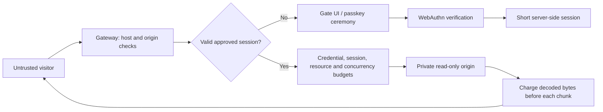

# Threat model

Voight has two modes with different objectives. Public mode is described first. The rest of this document, from [private mode](#private-mode-objective-and-boundary) on, covers private mode and the protections both modes share. This is a summary: the detailed threat model and field tests are kept private.

## Public mode: objective and boundary

Let people read the site, keep AI agents and automated browsers out, and make bulk extraction cost far more than reading. Concretely: refuse self-declared and signed AI agents, put a press-and-hold human check in front of every new visitor, bound the URLs, bytes and request rate any one network can take per window, make every additional identity cost increasing CPU work, and block networks that ignore limits for a time that grows with repeat offences. The human check gathers evidence of automation; it cannot prove that a visitor is human.

Identity is the visitor's network: the IPv4 address, or the IPv6 /64. It comes from the socket peer, or from `X-Forwarded-For` when the peer is in `TRUSTED_PROXIES`. The header is walked from the right, and parsing stops at the first untrusted hop. Networks are stored as HMACs keyed by a per-database secret. A solved proof-of-work check issues a clearance: a random token, stored hashed, with its own budget, valid for `CLEARANCE_SECONDS`.

| Attack | Handling / limitation |
| --- | --- |
| Crawl every URL from one address | Distinct-URL and byte budgets per network, then a check, then strikes and a timed block |
| Clear cookies, change user agent, use private windows | Budgets are keyed by network, so none of these reset them |
| Rotate IPv6 addresses within a subscriber allocation | Addresses in one /64 share a budget. Larger allocations (/56, /48) can still rotate /64s |
| Spoof `X-Forwarded-For` | Ignored unless the direct peer is a trusted proxy. Left-of-untrusted entries are never used |
| Mint many clearances | Capped per network per window; each costs one more bit of work (double the hashing) |
| Solve one check, share the clearance cookie across a botnet | All holders share that clearance's single budget |
| Replay or forge a solution | Challenges are single-use, bound to the issuing network, and verified server-side |
| Solve checks on a GPU or with native code | Feasible. The work cost is a speed bump that scales per identity, not a wall |
| Keep requesting while over budget | Each denial is a strike. Past `STRIKES_PER_WINDOW` the network is blocked for `BAN_SECONDS`, 4× longer on each repeat within `MAX_BAN_SECONDS`, capped at `MAX_BAN_SECONDS` |
| Many residential IPs (proxy pools) | Each network gets its own allowance. Total extraction grows with pool size. Not solved here |
| Slow agent staying within budget | Indistinguishable from a reader. Not solved here |
| Requests that bypass the gateway | Out of scope: the origin must be reachable only from the gateway |
| Cache in front of the gateway serving responses | Proxied responses are forced `private`, so shared caches should not store them. A misconfigured CDN can still bypass accounting |
| Embedding or hotlinking from other sites | Cross-site requests are rejected except top-level navigations, so links from other sites still work |

### AI agents and the human check

With `HUMAN_CHECK=suspicious` (the default), a request without a valid pass is let through unless there is a reason to ask, logged as `suspect:<reason>`. These are the basic rules' reasons; a rules pack can add its own:

| Reason | Trigger |
| --- | --- |
| `flagged` | The network failed the check, was blocked, or paged too fast in the last hour |
| `datacenter` | The address is in the cloud ranges file |
| `automation_user_agent` | `HeadlessChrome`, `Playwright`, `Puppeteer` or `Selenium` in the user agent |
| `not_a_browser` | The user agent does not start like a browser's (curl, Python, Go, feed readers) |
| `missing_fetch_metadata` | Chrome or Firefox 90+ without `Sec-Fetch-Mode`, which both always send |
| `paging` | More than `HUMAN_PAGES_PER_MINUTE` page loads a minute from one network without passes; flags the network for an hour |

Header rules only catch clients that do not bother to copy a browser; a real browser driven by a script passes them by construction.

With `HUMAN_CHECK=always`, or once there is a reason, a request without a valid pass gets the check page (HTML) or `403 human_check_required` (anything else). The page asks the server for a challenge, then the visitor holds the button for 1.5 seconds while a measuring script builds a report. The server judges the report with the detection rules and refuses it as:

- `automation_detected`: the rules found automation, or the report did not open with this check's key (`report_tampered`);
- `human_check_failed`: the gesture does not look like a person's;
- `sandbox_detected`: the server score reached 4.

The browser is not told which. For any refused check it gets only `human_check_failed`, as a JSON error or a page, with one generic message. The real reason and the signals behind it stay in the server log, under the request id shown on the page. A wrong answer to the small proof of work that rides along is rejected as `invalid_solution`.

### Detection rules

`src/rules.mjs` loads them: a private rules pack from the folder named by `RULES_DIR`, or `rules/` in the app folder if it exists (gitignored); otherwise the basic rules in `src/basic.mjs`. A pack is a folder whose `index.mjs` has the same exports as `src/basic.mjs`, and it replaces the basic rules entirely.

The basic rules catch only the obvious:

| Rule | Result |
| --- | --- |
| `navigator.webdriver` is set | `automation_detected` |
| HeadlessChrome, Playwright, Puppeteer or Selenium in the user agent or brand list | `automation_detected` |
| Desktop Chrome with no window frame and no plugins (headless Chrome) | `automation_detected` |
| A gesture the browser did not mark as trusted | `human_check_failed` |
| A hold shorter than 1.5 s by the page's clock or the server's | `human_check_failed` |
| A mouse that never moved before pressing | `human_check_failed` |
| A datacenter address | Scores 2: a pass that lasts an hour |

With `SANDBOX_CHECK=enforce` (the default), a score of 4 or more is refused and 2–3 gets a pass that lasts an hour; the basic rules never reach 4. `log` only records `sandbox:<score>` and the flags, for an operator who wants to measure false positives first. The pass cookie always carries the full pass length; a shorter pass is enforced on the server. Azure is deliberately not in the address list: Windows 365 and Azure Virtual Desktop put real people on Azure addresses.

### The scrambled check script

The measuring code is not part of the page. Each check gets its own copy of the rules' measuring script (`web/probe.template.js` for the basic rules), generated by `src/scramble.mjs` and served once to the browser holding that check's cookie: strings move into an encoded table in random order, identifiers get random names, and the report is encrypted with a key that only that copy contains. The server keeps only the keys. A report that was rewritten in transit, sealed with another check's key, or sent in plain form is refused (`report_tampered`).

This raises the cost of forging; it does not prevent it. The key is in the script, so a client that takes each script apart can produce a valid report. Anything client-side can be forged by a client that rewrites the page or calls the endpoints directly.

In desktop Firefox the check page may first step to a small hop page and straight back.

### Passes and attacks

A pass is a random token, stored hashed, valid for `HUMAN_PASS_SECONDS` (six hours by default) and only with the same user agent. Each network can earn `HUMAN_PASSES_PER_HOUR`. More than `HUMAN_PAGES_PER_MINUTE` page loads in a minute, or more than `HUMAN_PAGES_PER_PASS` in all, revokes the pass and shows the check again.

| Attack | Handling / limitation |
| --- | --- |
| Self-declared AI crawler or assistant (GPTBot, ChatGPT-User, ClaudeBot, Claude-User, PerplexityBot, …) | Refused on every request except `robots.txt`, the favicon and `/.well-known/` files |
| Firefox's AI link previews (`X-Firefox-Ai` header) | Refused like a named AI agent |
| Signed agent (Web Bot Auth: `Signature-Agent`, e.g. ChatGPT agent) | Refused. The signature is not verified because a forged header only shuts out its sender |
| AI app browser that names itself (e.g. `Claude/2.x` in the user agent) | Refused |
| A scraper or agent that pulls links out of a gate page's HTML and fetches them | The hidden link (inside a `<template>`, never shown, followed or prefetched by browsers) blocks its network for `BAN_SECONDS`, longer on repeats (`honeypot`). A tool that skips it is not caught by it |
| A client that copies an allowed user agent from the operator's `POLICY_FILE` | Gets what that rule allows. Rules by network (`cidr`) cannot be copied this way |
| A scraper asking for pages with `OPEN_GRAPH=on` | Gets the check page with each page's title, description and preview image, at most 30 origin reads a minute per network, cached; never the page body |
| Automation that declares itself (webdriver flag, an automation tool in the user agent, headless Chrome) | Refused by the basic rules |
| Agent that presses without moving the mouse first | Fails (`human_check_failed`) |
| Automation built to hide | Not caught by the basic rules. A rules pack can look for more, but a careful attacker driving a real browser on a real device can get through. Budgets, re-checks and blocks still apply |
| Script copying every browser header from a datacenter | Asked (`datacenter`). With the basic rules it scores 2 and gets a pass that lasts an hour |
| Script driving a real browser from a home connection, reading slowly (`suspicious` mode) | **Not asked.** Same headers as a person; only paging, budgets and blocks apply. `HUMAN_CHECK=always` asks it |
| Agent in a person's real browser (Claude in Chrome, Comet, Atlas) | Mainstream agents stop at labelled human checks by design. Not enforced technically |
| Person passes the check, then lets an agent drive | Only the fast-paging re-check and budgets apply. Not solved here |
| Person on a virtual desktop (Citrix, Windows 365) or VPN | May share server traits. With the basic rules a datacenter address only shortens the pass to an hour; `SANDBOX_CHECK=log` records scores without acting on them |
| Copy the pass cookie into another client | Rejected unless the user agent matches; a scraper that copies it too shares that one pass and its re-check |
| Call the endpoints directly with forged signals | Possible for a determined author; each attempt needs a fresh challenge, a real 1.5 s wait and a proof of work, and passes are capped per network |
| Spoof a search-engine user agent | Skips the check only when reverse DNS lands in the engine's domain and resolves back to the same address |

Link-preview fetchers (chat and social apps) cannot pass the check, so shared links show no preview unless `OPEN_GRAPH=on`. AI search engines are refused by design.

**False positives are the main cost.** Many people behind one carrier-grade NAT, office or VPN share one budget. The check gives each browser its own budget, but the per-network cap on checks can run out on very large shared networks. Blocks are timed, explained on the block page, and liftable with `admin unban`. No block is permanent. Defaults have not been measured against real traffic, so start with generous limits.

Clients without JavaScript cannot pass either check. Assistive technology that drives the pointer programmatically may fail the pointer rules; keyboard holds remain available, and operators can turn the check off. Programmatic clients receive JSON with `Retry-After`, and they can solve the check through the same two endpoints if they choose to pay the work.

### Limits

- Bypasses exist. Every signal comes from the visitor's browser, and a client that controls the browser can forge it.
- A careful attacker driving a real browser on a real device can get through. The rules raise the cost of automation; they do not make it impossible.
- The basic rules in this repository stop tools that announce themselves, not tools built to hide.
- Nothing here claims that any tool, browser or setup is always stopped.
- The detailed threat model and field tests are kept private, and so are the production rules: published rules are easy to tune a bot against.

## Private mode: objective and boundary

Prevent an unapproved client from receiving protected origin content. Restrict the volume an approved credential can retrieve. The visitor's browser and every incoming header are untrusted. Admission is checked on the server before contacting a fixed, private upstream.

The operator, gateway host, SQLite store, TLS terminator, and upstream are trusted. A compromise of any of these is outside this prototype's protections. Sensitive content must not be published elsewhere, served by a public CDN, included in the gate HTML, or exposed on an alternate API/origin address.

## Request flow

## Attacks and current handling

| Attack | Handling / limitation |
| --- | --- |
| Direct HTTP scraper with no credentials | No origin content returned |
| Scraper requests API, asset, or encoded alternate path | Same admission boundary |
| Fabricated or modified session cookie | 256-bit opaque token checked against hashed database record |
| Replayed WebAuthn response | Challenge atomically deleted before verification |
| Wrong origin or RP ID, invalid signature, missing user verification | Rejected by server-side verification |
| Reused/expired enrollment invite | Atomic invite consumption after verification |
| Parallel requests | Atomic session budget, shared byte accounting, and per-credential concurrent transfer limit |
| Logging in again or restarting to reset limits | Per-minute limit and rolling byte/resource usage persist in SQLite across sessions and restarts |
| Enumerating records through query parameters | Each distinct path-plus-query combination consumes the rolling resource allowance |
| Compressed or chunked extraction | Actual decoded body chunks are charged before forwarding; Content-Length is not trusted |
| Disconnect while the origin is working | Fetch is aborted, concurrency slot released, incomplete request logged |
| Spoofed client IP or identity headers | Forwarded headers ignored; origin identity generated by gateway |
| Upstream redirect to another host | Rejected; fetch uses manual redirects |
| Stolen session | Short expiry and user-agent binding reduce exposure, but matching UA is trivial; this is not device binding |
| Operator approves an automated client | It may pass; invitations are an administrative trust boundary |
| Software authenticator claims user verification | Accepted with a valid invitation; trusted-device attestation is not implemented |
| Agent operates an already-approved browser | Can read within the same limits as that browser |
| Browser declares automation | Optional enforcement rejects narrow user-agent declarations and a positive WebDriver report; observe is the default |
| Agent suppresses declarations or lies about the report | May pass; explicitly demonstrated in the Chromium benchmark |
| Screenshots, copy/paste, or offline sharing | Cannot prevent after delivery |
| Volumetric/distributed denial of service | Requires infrastructure controls beyond this single process |

## Privacy and retention

No typing, mouse, canvas or invasive fingerprint telemetry is collected. The browser sends one boolean WebDriver declaration during enrollment/login. In observe/enforce modes it is bound to the ceremony and then to the short-lived session; off mode ignores it. SQLite also stores credential public keys, operator labels, short-lived challenges, token hashes, counters, time-bucketed byte usage, and resource HMACs linked to credentials. Resource HMACs cover the normalized path and query; plaintext URLs are not stored. The per-database HMAC key persists in SQLite. These records are pseudonymous operational data, not anonymous data. Challenges contain an invite hash, never the raw invitation. No passkey private key leaves the authenticator.

Expired invites, challenges, sessions, limit rows, byte buckets and resource records are removed every minute. Session report records cascade on expiry pruning, logout and revocation. Credential records, the resource HMAC key and revocation flags persist until the operator deliberately maintains the database. Raw logs contain timestamp, random request ID, status, decision reason, completion flag, charged-byte count and constant automation-signal names only. Raw user agents and report payloads are not logged. Incomplete streams are logged even when their HTTP status was already sent as 200. Operators are responsible for log rotation and database file permissions.

## Important operational limitations

- One gateway process / one local SQLite database. No multi-region coordination.
- Network limits use the socket peer unless that peer is listed in `TRUSTED_PROXIES`. Behind an unlisted reverse proxy, every visitor shares the proxy's budget. List only the proxies you operate. Trusting a broad range lets anyone in it choose their identity.
- Same-origin browser XSS or a malicious browser extension can act within an approved session.
- CSP, anti-caching headers, and iframe restrictions apply to origin responses and may break existing applications.
- The protected-request budget counts assets as well as document pages.
- Failed/aborted requests can consume budget. This favors denial over over-allocation.
- Byte limits measure decoded body bytes released into the response stream, not headers, timing channels, or exact network delivery. Whole chunks are withheld when a limit would be crossed. A browser can retain content delivered earlier.
- Resource limits count path plus query, without application-specific knowledge. Dynamic content at one URL is constrained by byte/request limits; a pool of approved credentials has a larger combined allowance.
- The tests prove extraction bounds under their specified policies. Approved agents that stay within those policies remain indistinguishable from approved readers here.
- Enforcement can reject legitimate automation or assistive workflows. Human false rejection has not been measured; start with observe mode and evaluate compatibility.
- Returning an admission UI with HTTP 401 to every denied protected path intentionally prioritizes data protection over application compatibility.

## Acceptance criteria

The automated suite must show zero upstream hits for unauthenticated tested paths; reject invalid or replayed ceremonies; enforce expiry/revocation/budgets across sessions and connections; account for decoded/partial bodies; release work on cancellation; retain usage on reopen; and admit valid signed credentials. Passing tests establishes these specified properties only. It is not evidence of universal bot detection, user compatibility, or production readiness.
