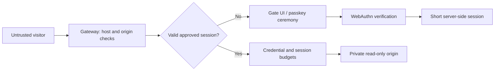

# Threat model

## Objective and boundary

Prevent an unapproved client from receiving protected origin content. Restrict the volume an approved credential can retrieve. The visitor's browser and every incoming header are untrusted. Admission is checked on the server before contacting a fixed, private upstream.

The operator, gateway host, SQLite store, TLS terminator, and upstream are trusted. A compromise of any of these is outside this prototype's protections. Sensitive content must not be published elsewhere, served by a public CDN, included in the gate HTML, or exposed on an alternate API/origin address.

## Request flow

## Attacks and current handling

| Attack | Handling / limitation |
| --- | --- |
| Direct HTTP scraper with no credentials | No origin content returned |
| Scraper requests API, asset, or encoded alternate path | Same admission boundary |
| Fabricated or modified session cookie | 256-bit opaque token checked against hashed database record |
| Replayed WebAuthn response | Challenge atomically deleted before verification |
| Wrong origin or RP ID, invalid signature, missing user verification | Rejected by server-side verification |
| Reused/expired enrollment invite | Atomic invite consumption after verification |
| Parallel requests | Atomic session budget and per-credential limit |
| Logging in again to reset limits | Per-minute credential limit persists across sessions |
| Spoofed client IP or identity headers | Forwarded headers ignored; origin identity generated by gateway |
| Upstream redirect to another host | Rejected; fetch uses manual redirects |
| Stolen session | Short expiry and user-agent binding reduce exposure, but matching UA is trivial; this is not device binding |
| Operator approves an automated client | It may pass; invitations are an administrative trust boundary |
| Software authenticator claims user verification | Accepted with a valid invitation; trusted-device attestation is not implemented |
| Agent operates an already-approved browser | Can read within the same limits as that browser |
| Screenshots, copy/paste, or offline sharing | Cannot prevent after delivery |
| Volumetric/distributed denial of service | Requires infrastructure controls beyond this single process |

## Privacy and retention

No behavioral telemetry or invasive fingerprinting is collected. SQLite stores credential public keys, operator labels, short-lived challenges, token hashes, and counters. Challenges contain an invite hash, never the raw invitation. No passkey private key leaves the authenticator.

Expired invites, challenges, sessions and limit rows are removed every minute. Credential records and revocation flags persist until the operator deliberately maintains the database. Raw logs contain timestamp, random request ID, status and decision reason only. Operators are responsible for log rotation and database file permissions.

## Important operational limitations

- One gateway process / one local SQLite database. No multi-region coordination.
- IP limits use the socket peer. Behind a reverse proxy, the current limit is shared across visitors. Do not enable arbitrary `X-Forwarded-For` trust to work around it.
- Same-origin browser XSS or a malicious browser extension can act within an approved session.
- CSP, anti-caching headers, and iframe restrictions apply to origin responses and may break existing applications.
- The protected-request budget counts assets as well as document pages.
- Failed/aborted requests can consume budget. This favors denial over over-allocation.
- Returning an admission UI with HTTP 401 to every denied protected path intentionally prioritizes data protection over application compatibility.

## Acceptance criteria

The automated suite must show zero upstream hits for unauthenticated tested paths; reject invalid or replayed ceremonies; enforce expiry/revocation/budgets; and admit valid signed credentials. Passing tests establishes these specified properties only. It is not evidence of universal bot detection, user compatibility, or production readiness.
