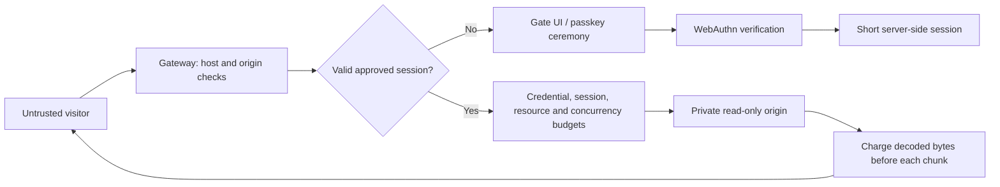

# Threat model

Voight has two modes with different objectives. Public mode is described first. The rest of this document, from [private mode](#private-mode-objective-and-boundary) on, covers private mode and the protections both modes share.

## Public mode: objective and boundary

Let people read the site, keep AI agents and automated browsers out, and make bulk extraction cost far more than reading. Concretely: refuse self-declared and signed AI agents, put a press-and-hold human check in front of every new visitor, bound the URLs, bytes and request rate any one network can take per window, make every additional identity cost increasing CPU work, and block networks that ignore limits for a time that grows with repeat offences. The human check gathers evidence of automation; it cannot prove that a visitor is human.

Identity is the visitor's network: the IPv4 address, or the IPv6 /64. It comes from the socket peer, or from `X-Forwarded-For` when the peer is in `TRUSTED_PROXIES`. The header is walked from the right, and parsing stops at the first untrusted hop. Networks are stored as HMACs keyed by a per-database secret. A solved proof-of-work check issues a clearance: a random token, stored hashed, with its own budget, valid for `CLEARANCE_SECONDS`.

| Attack | Handling / limitation |
| --- | --- |
| Crawl every URL from one address | Distinct-URL and byte budgets per network, then a check, then strikes and a timed block |
| Clear cookies, change user agent, use private windows | Budgets are keyed by network, so none of these reset them |
| Rotate IPv6 addresses within a subscriber allocation | Addresses in one /64 share a budget. Larger allocations (/56, /48) can still rotate /64s |
| Spoof `X-Forwarded-For` | Ignored unless the direct peer is a trusted proxy. Left-of-untrusted entries are never used |
| Mint many clearances | Capped per network per window; each costs one more bit of work (double the hashing) |
| Solve one check, share the clearance cookie across a botnet | All holders share that clearance's single budget |
| Replay or forge a solution | Challenges are single-use, bound to the issuing network, and verified server-side |
| Solve checks on a GPU or with native code | Feasible. The work cost is a speed bump that scales per identity, not a wall |
| Keep requesting while over budget | Each denial is a strike. Past `STRIKES_PER_WINDOW` the network is blocked for `BAN_SECONDS`, 4× longer on each repeat within `MAX_BAN_SECONDS`, capped at `MAX_BAN_SECONDS` |
| Many residential IPs (proxy pools) | Each network gets its own allowance. Total extraction grows with pool size. Not solved here |
| Slow agent staying within budget | Indistinguishable from a reader. Not solved here |
| Requests that bypass the gateway | Out of scope: the origin must be reachable only from the gateway |
| Cache in front of the gateway serving responses | Proxied responses are forced `private`, so shared caches should not store them. A misconfigured CDN can still bypass accounting |
| Embedding or hotlinking from other sites | Cross-site requests are rejected except top-level navigations, so links from other sites still work |

### AI agents and the human check

With `HUMAN_CHECK=suspicious` (the default), a request without a valid pass is let through unless there is a reason to ask, logged as `suspect:<reason>`:

| Reason | Trigger |
| --- | --- |
| `flagged` | The network failed the check (`automation_detected`, `sandbox_detected`, `human_check_failed`), was blocked, or paged too fast in the last hour |
| `datacenter` | The address is in the cloud ranges file |
| `automation_user_agent` | `HeadlessChrome`, `Playwright`, `Puppeteer` or `Selenium` in the user agent |
| `not_a_browser` | The user agent does not start like a browser's (curl, Python, Go, feed readers) |
| `missing_fetch_metadata` | Chrome or Firefox 90+ without `Sec-Fetch-Mode`, which both always send |
| `missing_client_hints` | Chromium 90+ without `Sec-CH-UA` in a secure context (Android WebView and Chrome on iOS are exempt) |
| `missing_language` | A page load without `Accept-Language`, or with `*` (Node's `fetch` default) |
| `paging` | More than `HUMAN_PAGES_PER_MINUTE` page loads a minute from one network without passes; flags the network for an hour |

Field test (Windows laptop): installed Edge read 20 pages a minute with no check and got it at page 21. curl, curl pretending to be Chrome, and headless Playwright got it on the first request. Playwright in a real window read directly, like Edge, until page 21. Live test on a real site over HTTPS (2026-10-05): in `suspicious` mode the owner's laptop browser loaded every page, script, font and video range with no check, while within minutes two datacenter clients and two scripts claiming to be Chrome got it. Switched to `always`, the owner passed first try with a mouse (65 movements, sandbox score 0) and with a phone's touch screen (sandbox score 0). A friend's Mac (Chrome 138, trackpad) read directly in `suspicious` mode and passed in `always` mode with 65 movements and sandbox score 1 (`bare_screen`: a hidden Dock or full-screen window leaves no reserved height, a known false positive at weight 1). Header rules only catch clients that do not bother to copy a browser; a real browser driven by a script passes them by construction. The one header rule aimed at automation tools is `unbranded_chromium`: on Windows and Mac, Chrome, Edge, Brave and Opera name themselves in `Sec-CH-UA`, while Playwright's and Puppeteer's bundled Chromium send only `"Chromium"` and a placeholder brand. A few rebuilt browsers do the same, so it asks rather than blocks, and Linux and Android are exempt.

With `HUMAN_CHECK=always`, or once there is a reason, a request without a valid pass gets the check page (HTML) or `403 human_check_required` (anything else). The page asks the server for a challenge, then the visitor holds the button for 1.5 seconds. The verify request reports the webdriver flag, known automation-tool globals, window frame size, plugin count, user-agent brands, whether the gesture was a trusted event, how long it was held, and the last 64 pointer steps. The server rejects:

- `automation_detected`: webdriver set, automation globals present, headless Chrome (a `HeadlessChrome` brand or user agent, or desktop Chrome with no window frame and no plugins), a mouse path in which one exact step of 2px or more occurs at least 10 times and makes up half or more of such steps, a DevTools-protocol client attached (`devtools_protocol`, below), desktop Firefox whose check page did not come back from the back/forward cache (`no_back_forward_cache` and `back_forward_reload`, below), or, on Windows, a Chromium mouse path whose moves almost never carried pointer predictions (`no_predicted_input`) or mostly fell between physical pixels (`off_grid_pointer`), cached requests from the page held far longer than the same requests from a shared worker (`request_interception`), or a touch hold on a PC without a multi-touch screen or on a Mac (`emulated_touch`, both below), or a Firefox mouse path whose moves reached the page as soon as they were stamped (`synthetic_event_time`, below), or Chromium that lets a frame change its history more than 200 times in 10 seconds (`no_navigation_limit`, below);
- `human_check_failed`: an untrusted gesture, a hold shorter than 1.5 s by the page's clock *or* the server's, or a mouse that reached the button without moving, arrived in a final leap of more than 80px, or pressed more than 3px from where it last moved (how agent click tools behave), or, on Windows, a held Space or Enter that never repeated (`no_key_repeat`, below);
- `invalid_solution`: the small proof of work that rides along is wrong.

### DevTools-protocol clients

Playwright, Puppeteer, Selenium 4 on Chrome, and most AI-agent browsers drive Chromium over the Chrome DevTools Protocol. Their mouse events are trusted and carry the same properties as a person's, so the check cannot tell them apart by input. What gives them away is that they enable the protocol's `Runtime` domain, after which V8 serialises every value the page logs and sends it to the client. At the end of the hold the page times 100 calls of `console.debug` with four `Error` objects against 100 with four numbers, seven rounds, and reports the median ratio (`devtools:<ratio>` in the log). At 3 or more the check fails with `devtools_protocol`. Only Chromium is judged, by user agent or by the engine the page finds (`navigator.userAgentData` or `window.chrome`), so Chromium claiming to be Firefox is still timed; Firefox and Safari log differently, and Chrome on iOS is WebKit.

Field measurements (Windows laptop, Edge 154, 125% display scaling):

| Browser | Ratio |
| --- | --- |
| A person's Edge, no automation | 1.29–1.50 (six runs) |
| The same, with six CPU-bound processes running | 1.22–1.57 |
| A person's Edge with DevTools open | 5.00–5.38 (refused; the message says to close DevTools) |
| Playwright Chromium, headless or in a window, any flags | 4.62–6.13 |
| Playwright driving installed Edge | 4.77–5.08 |
| Playwright attached over `connectOverCDP` to an Edge window opened normally | 4.47–6.04 |
| patchright (Playwright fork that avoids `Runtime.enable`) | 1.17–1.33: **not detected** by the timing (see scripted input, below) |

The ratio is self-normalising, so a slow machine is not a problem; what separates the two groups is serialisation work that only exists when a client is listening.

The same timing runs again in a Web Worker (`worker:<ratio>`, 400–520 calls per block because workers log faster). Playwright's init scripts, and most page-level hooks, never run in workers, but an attached client listens to them anyway: with `console.debug` wrapped in the page so the page ratio fell to 1.04, the worker still measured 4.58–5.81. Where the page measured, a worker that never answers, or whose report does not open with its own key, counts as tampering. A person's Edge and Chrome measured 1.30–1.45 in the worker (eight runs, including 125% scaling).

Both scripts also log one `Error` whose `name` and `message` are getters. A real console reads them, attached or not, in the page and in workers; a wrapper that swaps the arguments for harmless values does not. An unread `Error` counts as tampering (`console_tampered`). (These getters were rejected as a DevTools signal because they fire for everyone, which is exactly what makes them useful here.)

### Firefox-based automation (Camoufox, Playwright's Firefox)

The DevTools timing says nothing about Firefox, and Camoufox (a Firefox build for scraping, driven by Playwright over its own Juggler protocol) hides the webdriver flag and fakes a consistent machine. A script using it with a curved mouse path on a Mac at home passed the check on 2026-10-06 (65 movements, sandbox score 0).

What it cannot hide cheaply is that Playwright's Firefox switches off the back/forward cache (`browser.sessionhistory.max_total_viewers=0`; Camoufox's own notes call the difference page-visible). So on desktop Firefox, found by the user agent or by the engine the page sees (`navigator.buildID`, `-moz-appearance`), the check page first steps to `/_gate/human/hop` and the hop page goes straight back:

- A person's Firefox shows the check page again from its back/forward cache: nothing is loaded, the page receives `pageshow` with `persisted`, and only then asks for its challenge, naming the hop it made. The gateway counts that hop once, for the same user agent (`human_hop`).
- A browser without that cache loads the check page again. The hop left a 60-second cookie and a record of the page it was made from, so that load is refused at once (`automation_detected`, signal `back_forward_reload`). The check page is sent with `Vary: *` so that a stored copy is never reused without asking the gateway; without it, Camoufox reused its cached copy and the gateway saw nothing. In case a load is not seen anyway, the page gives up after two trips that did not come back and asks without a hop, and the verify request then fails with `no_back_forward_cache`.

For Firefox to keep the page it must be allowed to store it (`Cache-Control: private, no-cache`, not `no-store`), it must sit in its own browsing context group (`Cross-Origin-Opener-Policy: same-origin` on the check and hop pages, so a page opened by another site's script is not held by its opener), and it must have finished loading. The hop page only takes a same-origin top-level navigation (`Sec-Fetch-Site: same-origin`, `Sec-Fetch-Mode: navigate`, `Sec-Fetch-Dest: document`), so a `fetch` or a frame cannot stand in for the trip.

Field measurements (Windows laptop, against the real gateway on localhost, `HUMAN_CHECK=always`):

| Browser | Result |
| --- | --- |
| Installed Firefox 157, fresh profile | Came back from the cache; challenge issued with the hop counted |
| The same, private window | Came back |
| The same, with uBlock Origin, Dark Reader and Bitwarden | Came back |
| Firefox opened by another page's `window.open` (probe page with the same headers) | Came back; without the opener policy it did not |
| A 403 status on the page (probe page) | Came back |
| Installed Edge 154 | No trip; challenge issued as before |
| Camoufox 0.5.7 (browser 156.0.1) driven as the reported script drives it | Refused on loading again (`back_forward_reload`), before the button appeared |
| The same, before `Vary: *` was added | Page reused from the HTTP cache; refused at verify (`no_back_forward_cache`) |
| Camoufox with `browser.sessionhistory.max_total_viewers=-1` and `fission.bfcacheInParent=true` | Came back from the cache and got a challenge. Playwright then lost the page: every page call and even `mouse.move` failed with "Target crashed" (the tab's content process went away; the browser stayed connected). The script could not hold the button |

That last row is not a fix. On a probe page without the opener policy, the same two preferences plus "blind" input (sleeps and fixed coordinates, no page calls) completed a hold. Against the real check page on localhost, Playwright's own Firefox (155) with the same two preferences, the opener-policy header stripped by request interception and blind input lost the page in the same way: its first `mouse.move` after the trip failed with "Target crashed". Against itsmohak.me over HTTPS the same script, with webdriver hidden as well, came back from the cache, got a challenge and pressed, headed and headless; nothing above stopped it, and it was refused by the input timing below (`synthetic_event_time`). Operating-system input is judged only by the other pointer rules and the machine signals. Not yet measured: Firefox on Mac and Linux, Firefox ESR, Tor Browser, and Firefox with `browser.sessionhistory.max_total_viewers` or `browser.cache.memory` changed by hand. Firefox on Android phones and on iOS does not make the trip; a Firefox build that claims to be one of those (Android user agent and touch points) is not asked to either. A person whose Firefox fails the trip sees "Automated browser detected" with a note that changed settings or add-ons can cause it; reloading tries again.

### Scripted input in Firefox (Juggler)

Playwright drives Firefox, its own build and Camoufox alike, over Juggler, which makes mouse events inside the browser. They are trusted, and on Windows they land on whole physical pixels and say they came from a mouse (`mozInputSource` 1), as a person's do. Neither engine predicts moves in Firefox, and Firefox's coalesced events and `pointerrawupdate` look the same. The difference is the time stamp:

- **Event time** (`synthetic_event_time`, Firefox on Windows). Firefox stamps a mouse move with the time of the Windows message it came from, and Windows counts that time in clock ticks of 15.6 ms: a person's consecutive moves are stamped 0, 15 or 16 ms apart while they arrive every 6 to 14 ms. So the time from a move's stamp to the page's handler wanders across most of a tick. A move that Juggler makes is stamped when it is made and reaches the handler 0 to 2 ms later, every time. The check page records that delay for each of the last 64 mouse moves (`event.timeStamp` against `performance.now()`), and the middle half of them spreading over 2 ms or less, with at least 16 moves, fails the check (`lag-spread:<ms>/<moves>` in the log). Only judged when `performance.now()` steps by 1 ms or less (`resistFingerprinting` coarsens it, and also says Windows on every system) and the user agent says Windows: on other systems Firefox's stamps are exact, so a person's moves would look the same. Measured with Firefox 157 and Playwright's Firefox 155; a Firefox release that stamps moves exactly on Windows too would need this rule switched off.

Field measurements (Windows 11 laptop, 125% scaling):

| Input | Middle half of the delays (ms) |
| --- | --- |
| A person's mouse path through `SendInput`, quick sweep, slow 2-4 px steps, and the cursor set every 50 ms (`pyautogui`-style) | 9 to 11 over the whole path; never under 4 in any 12 moves in a row, or under 5 in any 16 |
| The same through the gate's real check script (scrambled, sealed and judged by the server's code) | 9 and 7: passes |
| Moves sent right on each Windows clock tick (the worst case, as from a tool on a system timer) | 5 over the path; 1 over its 16 steadiest moves |
| Playwright's Firefox, headed, paused or not, with the back/forward cache turned back on, window in front or behind | 1 |
| The same, headless, paused or not | 1 (delays a steady 5 to 6 ms without pauses) |
| The same through the gate's real check script | 1: refused, five of five |
| The same tuned as above (back/forward cache on, opener policy stripped, webdriver hidden) against itsmohak.me, headed and headless | 1 over 39 and 35 moves: refused, the only signal raised |

Key holds are not timed this way: a physical keyboard's repeat comes from a driver timer that may run on the clock tick, which would make a person's held key look scripted, so a script that sends repeated `keydown`s passes the keyboard path in Firefox unless something else stops it. Not measured: Firefox on Mac and Linux, pen and touch input, Firefox ESR.

### Launch switches in Chromium

Automation libraries start Chrome and Edge with a long list of switches, and one of them changes something a page can see. Chromium lets a frame change its history (`history.pushState` and `replaceState`, or the location) 200 times in 10 seconds and silently ignores the rest, which keeps a page from flooding the browser process (Chromium's "IPC flooding protection"). `--disable-ipc-flooding-protection` turns that off. The check's script makes 240 history changes in its own blank frame as it loads (a few milliseconds, nothing the visitor sees, and the page's own history is untouched) and reports how many took effect (`history:<n>` in the log). All 240 fails the check (`no_navigation_limit`). Judged for Chromium by engine or user agent; Firefox keeps its own limit and Safari throws, and neither is judged.

| Browser | History changes that took effect, of 240 |
| --- | --- |
| Edge 154 and Chrome 154 opened normally, fresh profiles | 200 |
| Edge opened with `--remote-debugging-port` (how nodriver-style tools start it) | 200 |
| Playwright attached over `connectOverCDP` to an Edge window opened normally | 200 (caught by the DevTools timing instead) |
| Playwright on installed Edge or Chrome, headed or headless | 240: refused, also through the real check script |
| The same with only `--disable-ipc-flooding-protection` removed (`ignoreDefaultArgs`) | 200 |
| Edge opened by hand with `--disable-ipc-flooding-protection` | 240 |
| Firefox 157 | 199 |

Which tools pass the switch by default, from their source code (October 2026; the tools themselves were not run, only Playwright was):

| Passes it (refused as they come) | Leaves it out (not caught by this) |
| --- | --- |
| Playwright, Puppeteer, rebrowser-patches, chrome-launcher (Lighthouse), Stagehand, browser-use, SeleniumBase (UC and CDP mode), Cypress, Crawlee | patchright (removes it), ChromeDriver with Selenium, WebdriverIO or undetected-chromedriver, nodriver, zendriver, pydoll, DrissionPage, Botasaurus |

Of the first column, browser-use's own session, SeleniumBase's CDP mode and rebrowser do not enable the DevTools `Runtime` domain, so the DevTools timing alone would not have caught them. This only reads how the browser was started: any of these tools can be told to leave the switch out, and a kiosk or test machine set up with it by hand is refused. A Chromium release old enough not to have the limit would be refused too.

### Scripted input and held requests in Chromium (patchright)

patchright is a Playwright fork that never enables the `Runtime` domain, so the DevTools timing reads like a person's (1.17–1.33), and driving installed Edge it shows the same machine as a person's Edge: every property the check page and a wider lab page read (voices, plugins, permissions, client hints, GPU, storage quota, media devices) matched a fresh Edge profile opened by hand. Its mouse, keyboard and touch events are trusted. Worker start-up time and the cost of logged security violations (patchright still enables the `Log` domain) were the same too. What is left is how the input arrives, and that patchright holds every request the page makes.

- **Mouse** (`no_predicted_input`, Chromium on Windows). Chromium attaches predictions of where a moving pointer goes next (`PointerEvent.getPredictedEvents()`) once moves arrive a few milliseconds apart, as they do from a mouse. The check's own script counts mouse moves and those that carried predictions, and reports `predicted:<with>/<moves>`. With 10 or more moves and fewer than a fifth predicted, the check fails. Predictions are missing only for the first few moves after the hand starts from rest.
- **Pixel grid** (`off_grid_pointer`, Chromium on Windows). The Windows cursor sits on whole physical pixels, so a mouse's `screenX` and `screenY` times the display scale are whole numbers. DevTools input is placed in CSS pixels, and a script's path lands between physical pixels almost every time. The check's script keeps the screen position of the last 64 mouse moves and reports `grid:<share>`, the share that sits on whole pixels. Page zoom changes the device pixel ratio but not the screen coordinates, so the server also tries each Windows display scale that, times a browser zoom level, gives the reported ratio, limited to the zoom levels the reported window heights allow. With 10 or more moves and less than 80% on the grid, the check fails.
- **Keyboard** (`no_key_repeat`, Windows). A key held down repeats after at most one second on Windows (its longest delay setting), so a 1.5-second hold of Space or Enter sends repeated keydowns. A script that presses once and waits sends one. The page reports `repeats:<n>`; none in a hold of 1.2 s or more fails the check as `human_check_failed`, not as automation, because people with key repeat turned off (Filter Keys) land here too, and the page then suggests holding the button with the pointer.
- **Held requests** (`request_interception`, Chromium on Windows). patchright intercepts every request on every page (it uses the DevTools `Fetch` domain to add its init scripts), and so does a Playwright or Puppeteer script that routes requests. The browser then holds each request, cache hits included, until the client process answers. A shared worker is outside the page, and patchright does not attach to it. The check page fetches one byte it keeps in the browser's cache (`/_gate/human/cached`) 8 times in a row from the page and 8 times from a shared worker (`/_gate/shared.js`), 6 rounds, and reports the fastest round of each. A page taking at least twice as long, and at least 0.3 ms more per fetch, fails the check (`fetches:<ratio>` in the log). Extensions that watch requests slow both sides alike, and a fetch that went to the network (the cache turned off) skips the comparison.
- **Touch** (`emulated_touch`). The DevTools protocol's touch emulation reports one touch point (or none when touch events are sent without it). Windows touchscreens report 5 or more and Macs have no touchscreen, so a touch hold on Windows with fewer than 2 touch points, or on a Mac with none, is refused. Android and iPad are not judged.

Field measurements (Windows laptop, Edge 154 and Chrome, 125% display scaling; the person's moves are operating-system input from `SendInput` on a fresh profile, the rest against the real gateway on localhost with `SANDBOX_CHECK=enforce`):

| Input | Result |
| --- | --- |
| A person's mouse on Edge, three runs | 27 of 32, 45 of 52 and 111 of 121 moves predicted |
| A person's mouse on Chrome | 111 of 121 predicted |
| A person's mouse: Edge (three runs), Chrome, page zoom 90%, 110%, 125% and 200%, browser forced to scale 1 and 1.5 | On the grid in every run (`grid:1.00`) |
| patchright on installed Edge, curved and eased 40-step path with a pause per step (the run that passed 0.9.1) | 0 of 40, three runs: refused (`no_predicted_input`, and `grid:0.00`) |
| The same path sent without pauses | 37 of 40 predicted, but `grid:0.00`, three runs: refused (`off_grid_pointer`; got in before the grid rule) |
| The same path snapped to whole physical pixels (the script first reads the page's screen offset and pixel ratio) | `grid:0.97`, 37 of 40 predicted, but cached fetches 2.76 and 2.90 times slower in the page: refused (`request_interception`; got in before that rule) |
| Cached fetches, page against shared worker: a person's Edge and Chrome, also under full CPU load and with an extension watching every request | 1.01 to 1.25 times |
| The same with DevTools open | 1.43 to 1.48 times |
| patchright, any input (pointer, keyboard, touch), fresh or persistent profile, also under load | 2.46 to 3.37 times: refused |
| Stock Playwright (no routes) | 1.45 times: not caught by this rule (caught by others) |
| patchright edited not to intercept requests, path snapped to whole pixels, no pauses | 1.21 and 1.29 times, `grid:0.97`: **got through** |
| An agent that teleports the operating-system cursor (`SetCursorPos`) | Moves 400 ms apart, last leap onto the button: `human_check_failed` (jumped) |
| `pyautogui.moveTo` with a duration (cursor set every 50 ms in equal steps) | 0 of 21 predicted and one repeated step: refused (`no_predicted_input`, `synthetic_path`) |
| The same while a real mouse also crossed its window | 5 of 47: refused; 42 of 73: passed (the real mouse supplied the predictions) |
| patchright holding Space (`keyboard.down`, wait, `keyboard.up`) | 0 repeats: `human_check_failed` (`no_key_repeat`) |
| patchright with touch emulation, a touch held through `Input.dispatchTouchEvent` | 1 touch point: refused (`emulated_touch`) |
| Stock Playwright on installed Edge, same path | 0 of 40, refused (also `devtools_protocol` and `webdriver`) |

These are bar-raisers, not proofs. Measured in the lab, predictions follow the spacing of the moves, not where they come from: raw `Input.dispatchMouseEvent` moves sent 8 ms apart got 98 of 104, and patchright's path sent without pauses got 42 of 47. The grid rule stops that path, and a script that reads the screen offset and pixel ratio and rounds every point to a whole physical pixel passes both input rules; patchright is then stopped only because it holds requests. Edited not to intercept (or made to intercept shared workers as well), it **gets through**, and so does a DevTools client that never intercepted in the first place, if it also hides from the timing. A script can send repeated keydowns itself (`autoRepeat`), and can emulate 10 touch points. Operating-system input (`SendInput`, `pyautogui`, a remote-desktop tool driving a real window) produces real predictions, repeats and touch points, and gets through all three. Not yet measured: Mac and Linux (not judged there), custom display scales (such as 110%) combined with page zoom, touchpads, pens (a pen hold is not judged), and real touchscreens. Possible false positives: pointers that report about 30 times a second, such as some head and eye trackers and slow remote-desktop links, can land under the one-fifth line; software that holds a page's requests but not a shared worker's (not seen in the lab: an extension watching requests slows both) would fail `request_interception`.

### The scrambled check script

The measuring code is not part of the page. Each check gets its own copy of `web/probe.template.js` and `web/probe-worker.template.js`, generated by `src/scramble.mjs` and served once to the browser holding that check's cookie: strings move into an XOR-encoded table in random order, identifiers get random names, loop counts and logged numbers change, and the report is encrypted with a 32-byte key that only that copy contains (SHA-256 keystream, 16-byte SHA-256 checksum). The server keeps only the keys. A report that was rewritten in transit, sealed with another check's key, or sent in the old plain form is refused (`report_tampered`). The page script also checks that `console.debug`, `performance.now` and `fetch` were not replaced after it loaded and still look native through a fresh frame's `Function.prototype.toString`.

This raises the cost of forging; it does not prevent it. The key is in the script, so a client that takes each script apart, or runs it in a console wrapper written for it, can produce a valid report. Anything client-side can be forged by a client that rewrites the page or calls the endpoints directly. Not yet measured on Android, Mac or Linux Chrome; `devtools:<ratio>` is logged for every check so operators can see their own distribution. Ideas tested and rejected because a person's browser triggered them too: the well-known `Error.stack` getter trick (fires nowhere in Chrome 154), accessor getters on logged `Error.message` and `RegExp.source` (fire in every browser), and float noise in `screenX - clientX` (present on scaled displays).

### Machine signals

The page also reports what kind of machine it runs on, and the server adds whether the address is in a cloud provider's published server ranges. Each signal is weighed, because real people share some of them:

| Signal | Weight | Real personal device | Cloud browser |
| --- | --- | --- | --- |
| `datacenter` | 2 | Home or mobile ISP (VPNs are the exception) | AWS, Google Cloud, Oracle, DigitalOcean, Linode |
| `unbranded_browser` | 3 | Windows and Mac browsers name themselves (Chrome, Edge, Brave, Opera) | Playwright's and Puppeteer's bundled Chromium name only `Chromium` |
| `software_gpu` | 2 | NVIDIA, AMD, Intel, Apple | SwiftShader, llvmpipe, Microsoft Basic Render Driver |
| `gpu_spoofed` | 3 | Native WebGL getter; pixels match the named GPU | Patched getter, or a real GPU's name over SwiftShader's exact pixels |
| `os_mismatch` | 2 | Windows has Segoe UI / Calibri / Consolas; a Mac has Helvetica Neue / Menlo / Avenir | Windows or Mac user agent without any of them |
| `virtual_gpu` | 1 | Rare | VMware, VirtualBox, Parallels, QEMU, virtio |
| `no_voices` | 1 | Windows and macOS ship local speech voices | None (Playwright's bundled Chromium also has none) |
| `no_media_devices`, `no_webgl` | 1 each | Speakers, microphones; WebGL on | Often none |
| `bare_screen` | 1 | Taskbar, dock or menu bar takes some height | Virtual display with nothing reserved |
| `utc_clock` | 1 | Local time zone | Often UTC |

With `SANDBOX_CHECK=enforce` (the default), a score of 4 or more is refused with `sandbox_detected`, and 2–3 gets a pass that lasts an hour. `log` only records `sandbox:<score>` and the flags, for an operator who wants to measure false positives first. Azure is deliberately not in the address list: Windows 365 and Azure Virtual Desktop put real people on Azure addresses.

Field measurements on a Windows laptop: installed Edge scored 0. Playwright's Chromium in a real window scored 2 (no voices, bare screen) and still got through with a faked curved path. With a software GPU it scored 4; with the GPU name faked the way stealth plugins do, 5; from a datacenter address (simulated), 4. All three were refused.

A pass is a random token, stored hashed, valid for `HUMAN_PASS_SECONDS` (six hours by default) and only with the same user agent. Each network can earn `HUMAN_PASSES_PER_HOUR`. More than `HUMAN_PAGES_PER_MINUTE` page loads in a minute, or more than `HUMAN_PAGES_PER_PASS` in all, revokes the pass and shows the check again.

| Attack | Handling / limitation |
| --- | --- |
| Self-declared AI crawler or assistant (GPTBot, ChatGPT-User, ClaudeBot, Claude-User, PerplexityBot, …) | Refused on every request except `robots.txt`, the favicon and `/.well-known/` files |
| Firefox's AI link previews (`X-Firefox-Ai` header) | Refused like a named AI agent |
| A scraper or agent that pulls links out of a gate page's HTML and fetches them | The hidden link (inside a `<template>`, never shown, followed or prefetched by browsers) blocks its network for `BAN_SECONDS`, longer on repeats (`honeypot`). Tested with requests only; a tool that skips `/_gate/more/` or reads only what a browser renders is not caught by it |
| A client that copies an allowed user agent from the operator's `POLICY_FILE` | Gets what that rule allows. Rules by network (`cidr`) cannot be copied this way |
| A scraper asking for pages with `OPEN_GRAPH=on` | Gets the check page with each page's title, description and preview image, at most 30 origin reads a minute per network, cached; never the page body |
| Signed agent (Web Bot Auth: `Signature-Agent`, e.g. ChatGPT agent) | Refused. The signature is not verified because a forged header only shuts out its sender |
| AI app browser that names itself (e.g. `Claude/2.x` in the user agent) | Refused |
| Plain Playwright / Puppeteer / Selenium | Webdriver flag, headless traces, straight-line pointer steps, DevTools client; Playwright and Puppeteer also by their launch switch (`no_navigation_limit`) |
| AI browser agents and stealth tools started as they come: browser-use, Stagehand, SeleniumBase UC or CDP mode, rebrowser, Crawlee | Refused by the launch switch (`no_navigation_limit`; switch read from their source, mechanism field-tested with Playwright), plus whatever else each one trips |
| Playwright with the webdriver flag hidden, headless | Headless brand, missing frame and plugins, straight-line pointer steps, DevTools client |
| Headed Playwright with the flag hidden | DevTools client; straight-line pointer steps; unbranded Chromium on Windows or Mac |
| Playwright driving installed Chrome or Edge, faked human path | DevTools client (field-tested) |
| Playwright or an agent attached to a browser the person opened (`connectOverCDP`) | DevTools client (field-tested) |
| patchright with its bundled Chromium | Not caught by the timing. `unbranded_browser` plus `no_voices` scores 4, refused by the default `SANDBOX_CHECK=enforce` (field-tested); gets through in `log` mode |
| patchright or a similar fork driving installed Chrome or Edge with a faked human path, a pause per step | Refused on Windows: its moves carry no pointer predictions (`no_predicted_input`, field-tested; got in before 0.9.2) |
| The same fork sending its path without pauses | Refused on Windows: the points fall between physical pixels (`off_grid_pointer`, field-tested; got in before 0.9.2) |
| The same fork rounding every point to a whole physical pixel, without pauses | Refused: patchright holds every request, and cached fetches from the page take 2.5 to 3 times as long as from a shared worker (`request_interception`, field-tested; got in before that rule) |
| The same fork edited not to intercept requests, rounding to whole pixels, without pauses | **Gets through** (field-tested; patchright leaves out the launch switch above). Budgets, re-checks and blocks still apply |
| nodriver driven the way its README shows (a straight 10-step move, then a press) | Refused on the live site: `no_predicted_input`, `off_grid_pointer` (field-tested, nodriver 0.50.5 on installed Chrome) |
| nodriver 0.50.5 or zendriver 0.17.1 on installed Chrome, a curved, jittered path sent with `Input.dispatchMouseEvent`, every point rounded to a whole physical pixel, no pauses, then a hold | **Got through** on the live site (field-tested): DevTools timing 1.0 to 1.4, history limit kept (200), cached fetches 1.1 to 1.2, 36 of 40 moves predicted, `grid:0.97`. Both pass `--disable-features=IsolateOrigins,site-per-process`, but `site-per-process` is not a feature name (the feature is `SitePerProcess`), so site isolation stays on and they leave no launch trace: a frame from a second site kept its own thread in Chrome 154 opened that way, and shared the page's thread only with `SitePerProcess` or `--disable-site-isolation-trials` |
| Other tools or scripts that start Chrome or Edge with a debugging port and drive it without enabling `Runtime` (pydoll, DrissionPage, Botasaurus, hand-written CDP), or any tool above told to leave the launch switch out, driven the same way | **Expected to get through**, like nodriver (not field-tested with these tools) |
| Playwright or Puppeteer routing requests (`page.route`, `setRequestInterception`) | Expected to fail `request_interception` as well (not field-tested); both are also caught by the DevTools timing as they come |
| The same fork holding Space, or holding with emulated touch | Fails on Windows: no key repeat; touch on a PC without a touchscreen (field-tested) |
| Stock Playwright, webdriver flag hidden, `console.debug` replaced by an init script | Refused: `console_tampered` and `devtools_protocol` from the worker (field-tested) |
| Stock Playwright, verify request rewritten (`page.route`) to report a normal ratio | Refused: `report_tampered` (field-tested; got in before 0.9) |
| Stock Playwright, check script patched by name in transit | Refused: nothing to find by name; the timing still runs (field-tested) |
| Stock Playwright, `console.debug` wrapped in a Proxy that drops `Error` arguments, or all arguments | Refused: the dropped check uses another frame's `Error`, so `instanceof` filters miss it; dropping everything leaves a ratio of 0 (field-tested) |
| Stock Playwright, Proxy swapping every argument for a number | Refused: the worker still measures 5.6, and the logged `Error` is never read (field-tested; got in before the worker) |
| The same, with the worker script blocked, or with the Proxy prepended to the worker script | Refused: no worker report, or an unread `Error` in both (field-tested) |
| Stock Playwright, Proxy written for this check (reads `name` and `message`, then swaps) in the page and prepended to the worker | **Gets through** (field-tested). Each new check can be answered by a hook written against it |
| Camoufox or Playwright's Firefox, webdriver hidden, faked human path on a personal computer | Refused: the check page loads again instead of coming back from the back/forward cache (field-tested; got in before 0.9.1) |
| The same with the back/forward cache turned back on by preferences | Got a challenge, but Playwright lost the page and could not press (field-tested). Playwright's Firefox with the opener-policy header stripped and blind input: crashed on its first move on localhost, but on the live site came back and pressed (field-tested) |
| Any Juggler-driven Firefox that gets a mouse hold through on Windows | Refused: its moves reach the page as soon as they are stamped (`synthetic_event_time`; field-tested on the live site with the tuned Playwright Firefox above, headed and headless, which got in before 0.9.3). Camoufox itself not re-measured; it uses the same input code |
| The same claiming to be Firefox on a Mac or Linux | Not judged by the event time. **Expected to get through** if it also gets past the back/forward cache |
| Firefox driven with operating-system input, or a script that sends repeated keydowns for a keyboard hold | **Gets through** the Firefox input rules; the machine signals still apply |
| Camoufox claiming to be Firefox on an Android phone | Not asked to make the trip. The machine signals still apply |
| Agent that clicks by jumping the pointer onto the button | Fails: no pointer movement before the press, or the press lands away from the last movement |
| Script faking a curved, jittery, eased human path in a headed browser on a personal computer | Caught when driven over the DevTools protocol with `Runtime` enabled (stock Playwright, Puppeteer). A fork that avoids it gets through, as above |
| The same script on a cloud server | Refused with `SANDBOX_CHECK=enforce`: datacenter address, software GPU, missing voices and devices, bare screen (field-tested with a software GPU, a faked GPU name, and a simulated datacenter address) |
| Cloud browser with a real GPU, residential proxy and faked fonts and voices | **Gets through.** Each fake costs the operator money or effort, but none is impossible |
| Person on a virtual desktop (Citrix, Windows 365) or VPN | Can score 2–4. Why the default is `log` and why `enforce` shortens passes before it refuses |
| Agent in a person's real browser (Claude in Chrome, Comet, Atlas) | Mainstream agents stop at labelled human checks by design. Not enforced technically |
| Person passes the check, then lets an agent drive | Only the fast-paging re-check and budgets apply. Not solved here |
| Script driving a real browser from a home connection, reading slowly (`suspicious` mode) | **Not asked.** Same headers as a person; only paging, budgets and blocks apply. `HUMAN_CHECK=always` asks it, and the pointer rules then apply |
| Script copying every browser header from a datacenter | Asked (`datacenter`), then refused by the sandbox score with `SANDBOX_CHECK=enforce` |
| Copy the pass cookie into another client | Rejected unless the user agent matches; a scraper that copies it too shares that one pass and its re-check |
| Call the endpoints directly with forged signals | Possible for a determined author; each attempt needs a fresh challenge, a real 1.5 s wait and a proof of work, and passes are capped per network |
| Spoof a search-engine user agent | Skips the check only when reverse DNS lands in the engine's domain and resolves back to the same address |
| Keyboard hold through a remote-control protocol | On Windows the held key must repeat; a script can send the repeats itself. Elsewhere only the trust flag and timing apply |
| Computer-use agent moving the real cursor (screenshot, jump, click) | Fails: the pointer jumps onto the button (field-tested by moving the cursor with `SetCursorPos`) |
| `pyautogui.moveTo` with a duration | Refused on Windows: equal steps 50 ms apart carry no predictions (field-tested) |
| Operating-system input with a human-like path (`SendInput` at mouse rate, a remote-desktop tool, a hardware mouse emulator) | Real predictions, repeats, pixel grid and pointer path: judged only by the DevTools timing and machine signals, so it **gets through** |

Link-preview fetchers (chat and social apps) cannot pass the check, so shared links show no preview. AI search engines are refused by design.

**False positives are the main cost.** Many people behind one carrier-grade NAT, office or VPN share one budget. The check gives each browser its own budget, but the per-network cap on checks can run out on very large shared networks. Blocks are timed, explained on the block page, and liftable with `admin unban`. No block is permanent. Defaults have not been measured against real traffic, so start with generous limits.

Clients without JavaScript cannot pass either check. Assistive technology that drives the pointer programmatically may fail the pointer-path rules, and pointers that report about 30 times a second may fail `no_predicted_input` on Windows (tools that place the cursor at fractional positions may fail `off_grid_pointer`); keyboard holds remain available (on Windows the key must repeat), and operators can turn the check off. They see the wait time instead. Programmatic clients receive JSON with `Retry-After`, and they can solve the check through the same two endpoints if they choose to pay the work.

## Private mode: objective and boundary

Prevent an unapproved client from receiving protected origin content. Restrict the volume an approved credential can retrieve. The visitor's browser and every incoming header are untrusted. Admission is checked on the server before contacting a fixed, private upstream.

The operator, gateway host, SQLite store, TLS terminator, and upstream are trusted. A compromise of any of these is outside this prototype's protections. Sensitive content must not be published elsewhere, served by a public CDN, included in the gate HTML, or exposed on an alternate API/origin address.

## Request flow

## Attacks and current handling

| Attack | Handling / limitation |
| --- | --- |
| Direct HTTP scraper with no credentials | No origin content returned |
| Scraper requests API, asset, or encoded alternate path | Same admission boundary |
| Fabricated or modified session cookie | 256-bit opaque token checked against hashed database record |
| Replayed WebAuthn response | Challenge atomically deleted before verification |
| Wrong origin or RP ID, invalid signature, missing user verification | Rejected by server-side verification |
| Reused/expired enrollment invite | Atomic invite consumption after verification |
| Parallel requests | Atomic session budget, shared byte accounting, and per-credential concurrent transfer limit |
| Logging in again or restarting to reset limits | Per-minute limit and rolling byte/resource usage persist in SQLite across sessions and restarts |
| Enumerating records through query parameters | Each distinct path-plus-query combination consumes the rolling resource allowance |
| Compressed or chunked extraction | Actual decoded body chunks are charged before forwarding; Content-Length is not trusted |
| Disconnect while the origin is working | Fetch is aborted, concurrency slot released, incomplete request logged |
| Spoofed client IP or identity headers | Forwarded headers ignored; origin identity generated by gateway |
| Upstream redirect to another host | Rejected; fetch uses manual redirects |
| Stolen session | Short expiry and user-agent binding reduce exposure, but matching UA is trivial; this is not device binding |
| Operator approves an automated client | It may pass; invitations are an administrative trust boundary |
| Software authenticator claims user verification | Accepted with a valid invitation; trusted-device attestation is not implemented |
| Agent operates an already-approved browser | Can read within the same limits as that browser |
| Browser declares automation | Optional enforcement rejects narrow user-agent declarations and a positive WebDriver report; observe is the default |
| Agent suppresses declarations or lies about the report | May pass; explicitly demonstrated in the Chromium benchmark |
| Screenshots, copy/paste, or offline sharing | Cannot prevent after delivery |
| Volumetric/distributed denial of service | Requires infrastructure controls beyond this single process |

## Privacy and retention

No typing, mouse, canvas or invasive fingerprint telemetry is collected. The browser sends one boolean WebDriver declaration during enrollment/login. In observe/enforce modes it is bound to the ceremony and then to the short-lived session; off mode ignores it. SQLite also stores credential public keys, operator labels, short-lived challenges, token hashes, counters, time-bucketed byte usage, and resource HMACs linked to credentials. Resource HMACs cover the normalized path and query; plaintext URLs are not stored. The per-database HMAC key persists in SQLite. These records are pseudonymous operational data, not anonymous data. Challenges contain an invite hash, never the raw invitation. No passkey private key leaves the authenticator.

Expired invites, challenges, sessions, limit rows, byte buckets and resource records are removed every minute. Session report records cascade on expiry pruning, logout and revocation. Credential records, the resource HMAC key and revocation flags persist until the operator deliberately maintains the database. Raw logs contain timestamp, random request ID, status, decision reason, completion flag, charged-byte count and constant automation-signal names only. Raw user agents and report payloads are not logged. Incomplete streams are logged even when their HTTP status was already sent as 200. Operators are responsible for log rotation and database file permissions.

## Important operational limitations

- One gateway process / one local SQLite database. No multi-region coordination.
- Network limits use the socket peer unless that peer is listed in `TRUSTED_PROXIES`. Behind an unlisted reverse proxy, every visitor shares the proxy's budget. List only the proxies you operate. Trusting a broad range lets anyone in it choose their identity.
- Same-origin browser XSS or a malicious browser extension can act within an approved session.
- CSP, anti-caching headers, and iframe restrictions apply to origin responses and may break existing applications.
- The protected-request budget counts assets as well as document pages.
- Failed/aborted requests can consume budget. This favors denial over over-allocation.
- Byte limits measure decoded body bytes released into the response stream, not headers, timing channels, or exact network delivery. Whole chunks are withheld when a limit would be crossed. A browser can retain content delivered earlier.
- Resource limits count path plus query, without application-specific knowledge. Dynamic content at one URL is constrained by byte/request limits; a pool of approved credentials has a larger combined allowance.
- The tests prove extraction bounds under their specified policies. Approved agents that stay within those policies remain indistinguishable from approved readers here.
- Enforcement can reject legitimate automation or assistive workflows. Human false rejection has not been measured; start with observe mode and evaluate compatibility.
- Returning an admission UI with HTTP 401 to every denied protected path intentionally prioritizes data protection over application compatibility.

## Acceptance criteria

The automated suite must show zero upstream hits for unauthenticated tested paths; reject invalid or replayed ceremonies; enforce expiry/revocation/budgets across sessions and connections; account for decoded/partial bodies; release work on cancellation; retain usage on reopen; and admit valid signed credentials. Passing tests establishes these specified properties only. It is not evidence of universal bot detection, user compatibility, or production readiness.
