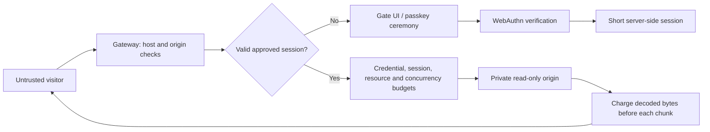

# Threat model

Human Gate has two modes with different objectives. Public mode is described first. The rest of this document, from [private mode](#private-mode-objective-and-boundary) on, covers private mode and the protections both modes share.

## Public mode: objective and boundary

Let anyone read the site, but make bulk extraction cost far more than reading. Concretely: bound the URLs, bytes and request rate any one network can take per window, make every additional identity cost increasing CPU work, and block networks that ignore limits for a time that grows with repeat offences. It does **not** attempt to classify individual requests as human or automated.

Identity is the visitor's network: the IPv4 address, or the IPv6 /64. It comes from the socket peer, or from `X-Forwarded-For` when the peer is in `TRUSTED_PROXIES`. The header is walked from the right, and parsing stops at the first untrusted hop. Networks are stored as HMACs keyed by a per-database secret. A solved proof-of-work check issues a clearance: a random token, stored hashed, with its own budget, valid for `CLEARANCE_SECONDS`.

| Attack | Handling / limitation |
| --- | --- |
| Crawl every URL from one address | Distinct-URL and byte budgets per network, then a check, then strikes and a timed block |
| Clear cookies, change user agent, use private windows | Budgets are keyed by network, so none of these reset them |
| Rotate IPv6 addresses within a subscriber allocation | Addresses in one /64 share a budget. Larger allocations (/56, /48) can still rotate /64s |
| Spoof `X-Forwarded-For` | Ignored unless the direct peer is a trusted proxy. Left-of-untrusted entries are never used |
| Mint many clearances | Capped per network per window; each costs one more bit of work (double the hashing) |
| Solve one check, share the clearance cookie across a botnet | All holders share that clearance's single budget |
| Replay or forge a solution | Challenges are single-use, bound to the issuing network, and verified server-side |
| Solve checks on a GPU or with native code | Feasible. The work cost is a speed bump that scales per identity, not a wall |
| Keep requesting while over budget | Each denial is a strike. Past `STRIKES_PER_WINDOW` the network is blocked for `BAN_SECONDS`, 4× longer on each repeat within `MAX_BAN_SECONDS`, capped at `MAX_BAN_SECONDS` |
| Many residential IPs (proxy pools) | Each network gets its own allowance. Total extraction grows with pool size. Not solved here |
| Slow agent staying within budget | Indistinguishable from a reader. Not solved here |
| Requests that bypass the gateway | Out of scope: the origin must be reachable only from the gateway |
| Cache in front of the gateway serving responses | Proxied responses are forced `private`, so shared caches should not store them. A misconfigured CDN can still bypass accounting |
| Embedding or hotlinking from other sites | Cross-site requests are rejected except top-level navigations, so links from other sites still work |

**False positives are the main cost.** Many people behind one carrier-grade NAT, office or VPN share one budget. The check gives each browser its own budget, but the per-network cap on checks can run out on very large shared networks. Blocks are timed, explained on the block page, and liftable with `admin unban`. No block is permanent. Defaults have not been measured against real traffic, so start with generous limits.

Clients without JavaScript cannot pass the check. They see the wait time instead. Programmatic clients receive JSON with `Retry-After`, and they can solve the check through the same two endpoints if they choose to pay the work.

## Private mode: objective and boundary

Prevent an unapproved client from receiving protected origin content. Restrict the volume an approved credential can retrieve. The visitor's browser and every incoming header are untrusted. Admission is checked on the server before contacting a fixed, private upstream.

The operator, gateway host, SQLite store, TLS terminator, and upstream are trusted. A compromise of any of these is outside this prototype's protections. Sensitive content must not be published elsewhere, served by a public CDN, included in the gate HTML, or exposed on an alternate API/origin address.

## Request flow

## Attacks and current handling

| Attack | Handling / limitation |
| --- | --- |
| Direct HTTP scraper with no credentials | No origin content returned |
| Scraper requests API, asset, or encoded alternate path | Same admission boundary |
| Fabricated or modified session cookie | 256-bit opaque token checked against hashed database record |
| Replayed WebAuthn response | Challenge atomically deleted before verification |
| Wrong origin or RP ID, invalid signature, missing user verification | Rejected by server-side verification |
| Reused/expired enrollment invite | Atomic invite consumption after verification |
| Parallel requests | Atomic session budget, shared byte accounting, and per-credential concurrent transfer limit |
| Logging in again or restarting to reset limits | Per-minute limit and rolling byte/resource usage persist in SQLite across sessions and restarts |
| Enumerating records through query parameters | Each distinct path-plus-query combination consumes the rolling resource allowance |
| Compressed or chunked extraction | Actual decoded body chunks are charged before forwarding; Content-Length is not trusted |
| Disconnect while the origin is working | Fetch is aborted, concurrency slot released, incomplete request logged |
| Spoofed client IP or identity headers | Forwarded headers ignored; origin identity generated by gateway |
| Upstream redirect to another host | Rejected; fetch uses manual redirects |
| Stolen session | Short expiry and user-agent binding reduce exposure, but matching UA is trivial; this is not device binding |
| Operator approves an automated client | It may pass; invitations are an administrative trust boundary |
| Software authenticator claims user verification | Accepted with a valid invitation; trusted-device attestation is not implemented |
| Agent operates an already-approved browser | Can read within the same limits as that browser |
| Browser declares automation | Optional enforcement rejects narrow user-agent declarations and a positive WebDriver report; observe is the default |
| Agent suppresses declarations or lies about the report | May pass; explicitly demonstrated in the Chromium benchmark |
| Screenshots, copy/paste, or offline sharing | Cannot prevent after delivery |
| Volumetric/distributed denial of service | Requires infrastructure controls beyond this single process |

## Privacy and retention

No typing, mouse, canvas or invasive fingerprint telemetry is collected. The browser sends one boolean WebDriver declaration during enrollment/login. In observe/enforce modes it is bound to the ceremony and then to the short-lived session; off mode ignores it. SQLite also stores credential public keys, operator labels, short-lived challenges, token hashes, counters, time-bucketed byte usage, and resource HMACs linked to credentials. Resource HMACs cover the normalized path and query; plaintext URLs are not stored. The per-database HMAC key persists in SQLite. These records are pseudonymous operational data, not anonymous data. Challenges contain an invite hash, never the raw invitation. No passkey private key leaves the authenticator.

Expired invites, challenges, sessions, limit rows, byte buckets and resource records are removed every minute. Session report records cascade on expiry pruning, logout and revocation. Credential records, the resource HMAC key and revocation flags persist until the operator deliberately maintains the database. Raw logs contain timestamp, random request ID, status, decision reason, completion flag, charged-byte count and constant automation-signal names only. Raw user agents and report payloads are not logged. Incomplete streams are logged even when their HTTP status was already sent as 200. Operators are responsible for log rotation and database file permissions.

## Important operational limitations

- One gateway process / one local SQLite database. No multi-region coordination.
- Network limits use the socket peer unless that peer is listed in `TRUSTED_PROXIES`. Behind an unlisted reverse proxy, every visitor shares the proxy's budget. List only the proxies you operate. Trusting a broad range lets anyone in it choose their identity.
- Same-origin browser XSS or a malicious browser extension can act within an approved session.
- CSP, anti-caching headers, and iframe restrictions apply to origin responses and may break existing applications.
- The protected-request budget counts assets as well as document pages.
- Failed/aborted requests can consume budget. This favors denial over over-allocation.
- Byte limits measure decoded body bytes released into the response stream, not headers, timing channels, or exact network delivery. Whole chunks are withheld when a limit would be crossed. A browser can retain content delivered earlier.
- Resource limits count path plus query, without application-specific knowledge. Dynamic content at one URL is constrained by byte/request limits; a pool of approved credentials has a larger combined allowance.
- The tests prove extraction bounds under their specified policies. Approved agents that stay within those policies remain indistinguishable from approved readers here.
- Enforcement can reject legitimate automation or assistive workflows. Human false rejection has not been measured; start with observe mode and evaluate compatibility.
- Returning an admission UI with HTTP 401 to every denied protected path intentionally prioritizes data protection over application compatibility.

## Acceptance criteria

The automated suite must show zero upstream hits for unauthenticated tested paths; reject invalid or replayed ceremonies; enforce expiry/revocation/budgets across sessions and connections; account for decoded/partial bodies; release work on cancellation; retain usage on reopen; and admit valid signed credentials. Passing tests establishes these specified properties only. It is not evidence of universal bot detection, user compatibility, or production readiness.
